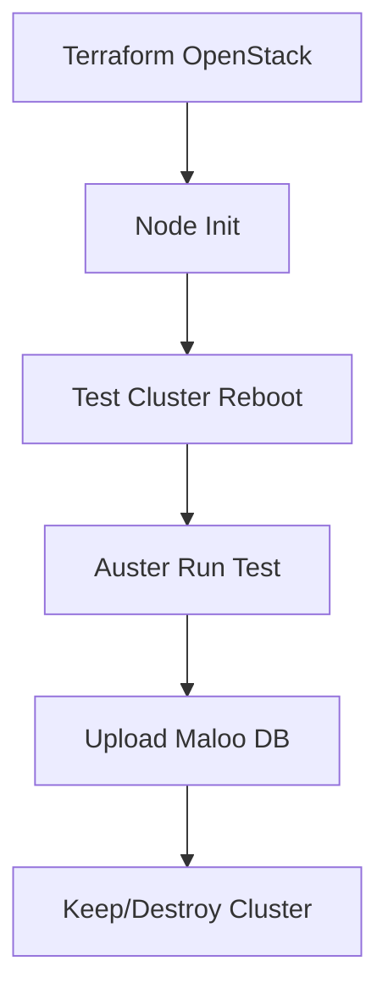

# The Lustre Builder

This repo include all the script we needs for Lustre Arm64 external Builder and Tester CI

## Lustre CI pipeline

```mermaid
graph TD
A[Terraform OpenStack]-->B[Node Init]
B-->C[Test Cluster Reboot]
C-->D[Auster Run Test]
D-->E[Upload Maloo DB]
E-->F[Keep/Destroy Cluster]
```
