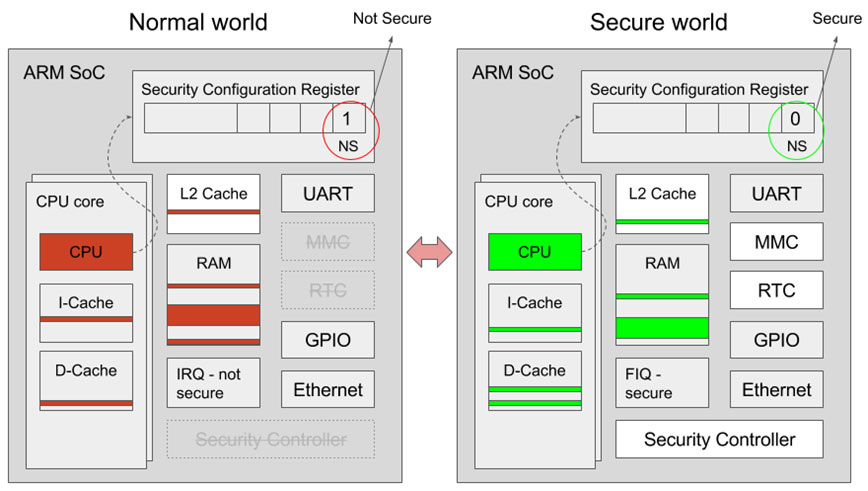
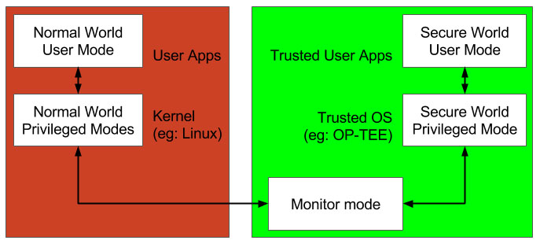
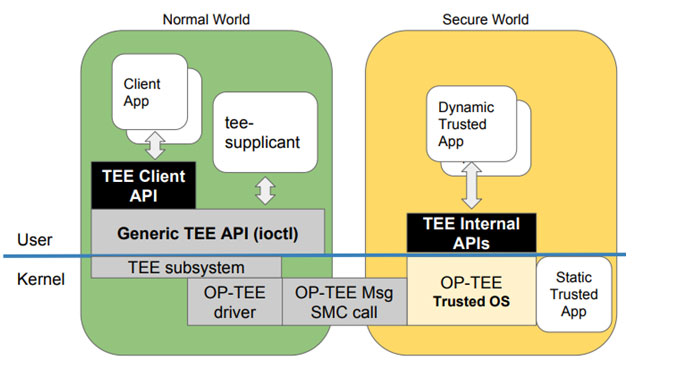
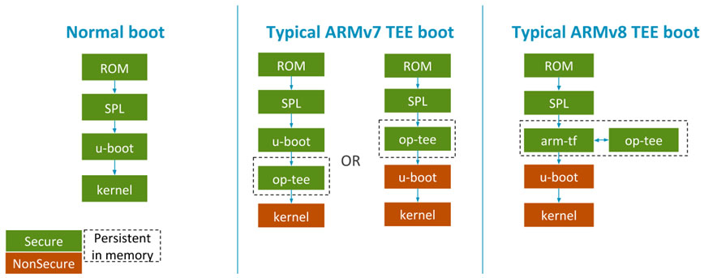

# Trust Zone and OP-TEE
## 基本概念扫盲
Arm公司提出的了trustzone技术,用一根安全总线（称为NS位）来判断当前处于secure world还是non-secure world状态,状态的切换由ATF(arm trusted firmware)来完成。TEE全称为Trusted execute environment,也就是信任执行环境。TEE是基于trustzone技术搭建的安全执行环境。

硬件视图

软件视图

底层实现：当处于secure world状态，那么就会执行TEE OS部分的代码,当处于non-secure world状态时,就执行linux kernel部分的代码

Linux内核能直接访问TEE部分的资源吗？
Linux kernel不能直接访问TEE部分的资源。通过特定的TA(Trust Appliaction)和CA(Client Application)来访问TEE部分特定的资源

OP-TEE包括：Secure world OS(optee_os)、normal world client(optee_client)、test suite(optee_test/xtest)以及linux驱动

架构和使用方式：运行在linux上的client application(CA)和一个运行在OP-TEE上的trusted application(TA),CA使用TEE client API与TA通信,并且从TA获取安全服务。CA和TA使用共享内存进行通信。

OP-TEE启动：

在一个基于ARMv8的处理器上，TEE启动流程还涉及到一个SPL加载ARM Trusted firmware的步骤。SPL跳转到arm trusted firmware,这个firmware随后与OP-TEE共同协作,OP-TEE转而跳转到处于非安全上下文的U-Boot中。在一个ARMv8平台上,ARM Trusted firmware提供一个监视器代码去管理安全世界和非安全世界之间的切换,而在ARMv7平台上这一功能是被嵌入到OP-TEE中的。

OP-TEE对Linux的支持情况：针对OP-TEE的linux内核驱动出现在内核版本4.12及其以上的版本,如果您运行的内核版本较老，那么您需要backport 补丁(https://lwn.net/Articles/716737/)。

OP-TEE OS为TA提供安全数据存储设备：数据要么以某种加密/授权的方式存储在linux文件系统/data/tee中，要么就是存储在一个Emmc RPMB（Replay Protected Memory Block，重放保护内存块）的分区中

## Reference
https://www.cnblogs.com/dakewei/p/10267774.html

https://kernel.meizu.com/2017/08/17-33-25-tee_fp.html

Nitro Enclave: https://zhuanlan.zhihu.com/p/435920745

Armv9 realms: https://blog.csdn.net/weixin_42135087/article/details/121174706

CCA概念简单总结：https://inclavare-containers.io/blog/realm/ https://zhuanlan.zhihu.com/p/363506264

